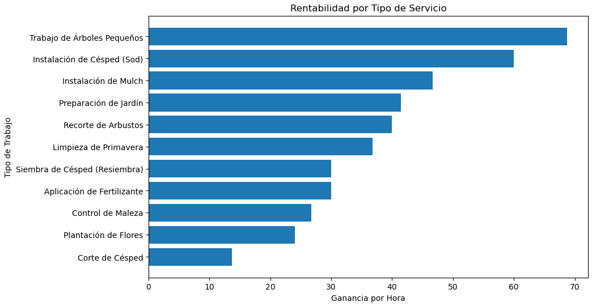

# Análisis de Rentabilidad de Servicios de Jardinería (Primavera)

## 📊 Resumen Ejecutivo

Este análisis identifica qué servicios de jardinería generan más ganancia por hora, permitiendo optimizar precios, priorizar servicios y maximizar el uso del tiempo.

💡 Insight clave:
Los trabajos de árboles pequeños generan casi **5x más ganancia por hora** que el corte de césped.

## Objetivo

Este proyecto analiza diferentes tipos de trabajos de jardinería para identificar cuáles generan más rentabilidad y cuáles aprovechan mejor el tiempo de trabajo. El objetivo es ayudar a mejorar decisiones de precios, servicios y eficiencia en el negocio.

## Problema

En muchos negocios de jardinería, no siempre es claro qué servicios son los más rentables. Algunos trabajos generan ingresos constantes, pero no necesariamente la mejor ganancia por hora. Sin un análisis claro, es difícil saber en qué servicios enfocarse para maximizar rentabilidades.

## Método

Se analizaron diferentes tipos de trabajos de jardinería utilizando datos como:

- Precio cobrado  
- Costo de materiales  
- Costo de mano de obra  
- Tiempo trabajado  

A partir de estos datos, se calcularon:

- Costo total  
- Ganancia  
- Ganancia por hora

Nota: Los datos utilizados en este análisis son simulados pero reflejan escenarios realistas basados en precios y tiempos comunes en la industria de jardinería.

## 🛠️ Herramientas Utilizadas

- Python (pandas)
- Visualización de datos (matplotlib)
- Análisis de rentabilidad

  ## Visualización
A continuación se muestra la rentabilidad por hora de cada tipo de servicio, ordenada de menor a mayor.

  ## Resultados Clave

- Los trabajos de árboles pequeños generan la mayor ganancia por hora  
- La instalación de césped (sod) muestra alta rentabilidad  
- Los trabajos de mulch son consistentes y rentables  
- El corte de césped genera ingresos constantes, pero menor ganancia por hora

## Recomendación

Enfocarse más en servicios de alta rentabilidad y optimizar los trabajos de menor ganancia puede aumentar significativamente las ganancias del negocio. También Se recomienda aumentar precios o reducir tiempo en servicios con baja rentabilidad, y enfocar la agenda en trabajos de alta ganancia por hora.

## Conclusión

Este análisis demuestra que no todos los servicios generan el mismo valor por hora. Priorizar trabajos de alta rentabilidad como árboles pequeños y césped (instalación) puede aumentar significativamente las ganancias del negocio sin necesidad de aumentar el volumen de trabajo. El uso de datos permite tomar decisiones más estratégicas y maximizar el uso del tiempo disponible.

## 💥 Impacto Potencial

Aplicando este análisis, un negocio de jardinería puede aumentar sus ingresos sin trabajar más horas, simplemente tomando mejores decisiones sobre qué trabajos aceptar y cómo fijar precios.

## 📌 Aplicación Práctica

Este tipo de análisis puede ser utilizado por negocios de jardinería para:

- Ajustar precios según rentabilidad real
- Priorizar servicios más eficientes
- Mejorar la planificación del tiempo de trabajo

## ⏱️ Optimización del Tiempo Semanal

Dado que el tiempo de trabajo es limitado, priorizar los servicios con mayor rentabilidad por hora puede aumentar significativamente los ingresos semanales sin necesidad de trabajar más horas. Por ejemplo, en lugar de llenar la semana con trabajos de baja rentabilidad como el corte de césped, el negocio puede enfocarse en servicios como trabajos de árboles o instalación de césped, generando más ingresos en menos tiempo.
